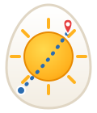
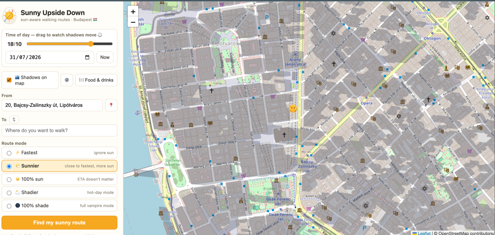

<div align="center">



# 🍳 Sunny Upside Down

**A walking-route planner that keeps you in the sunshine — or in the shade.**

Because the shortest way home is not always the nicest one.

[](LICENSE)
[](https://www.openstreetmap.org/copyright)
[](#-configuration-optional)
[-e53e3e.svg)](#-budapest-only-for-now)
[](#-technologies)

</div>

---

## 📖 About

Every map app answers the same question: *what is the fastest way there?*
**Sunny Upside Down** answers a different one: **what is the sunniest way there?**

You give it a destination, it plans a walk that keeps you in direct sunlight as much as
possible — or, on a 35 °C Budapest summer afternoon, one that keeps you in the shade the
whole way. It knows where the sun will be at any minute of any day, it knows how tall the
buildings are, and it works out which side of which street will actually be lit.

It is a single static HTML page. No build step, no account, no API key, no tracking, and
no bills — every data source it uses is free and open.

## 📸 Demo



*Downtown Budapest at 17:40 — grey polygons are real building shadows for that exact moment;
the route is drawn gold where you walk in sun and slate-blue where you walk in shade.*

## 📍 Budapest only (for now)

**This app currently works for Budapest, Hungary only.** That is a deliberate scope choice,
not a technical limit:

- address search is restricted to the Budapest bounding box,
- the map opens downtown, and the bundled offline extract (`seed.json`) covers central Pest/Buda,
- shadow accuracy has only been sanity-checked on Budapest streets.

The engine itself is city-agnostic. Adapting it to another city means changing the bounding
box and the start coordinates (see [Contributing](#-contributing)) — pull requests that
generalise this properly are very welcome.

## ✨ Features

| | |
|---|---|
| ☀️ **Sun-aware routing** | Five modes: ⚡ Fastest · 🌤️ Sunnier · ☀️ 100 % sun · ⛅ Shadier · 🌑 100 % shade |
| 📊 **Honest comparison** | Every route is scored against the plain shortest path: *"+24 pp sun (32 % more sun than the fastest route) · +3 min longer"* |
| 🏙️ **Live shadow map** | Real building shadows drawn on the map — no destination needed, just pan around |
| 🕐 **Time travel** | Drag the time slider and watch shadows sweep across the city; pick any date, past or future |
| 🌡️ **Hot-day mode** | The whole thing in reverse — maximum shade for summer afternoons |
| 🍽️ **Places to walk to** | Toggle restaurants, cafés, bars and beer gardens, then tap one → "Walk here" |
| 🎨 **Sun/shade route colouring** | The route line itself is gold in the sun, slate-blue in the shade |
| ☁️ **Cloud check** | Shows the cloud-cover forecast for your walking hour — no point chasing sun under an overcast sky |
| 💾 **Offline-ish caching** | Every downloaded map tile is cached in your browser for 45 days; your neighbourhood loads instantly after the first visit |
| 🔗 **Shareable links** | `?t=17:30&d=2026-07-31&ll=47.4977,19.0546,17` opens the map at that time, date and place |
| 🌍 **Free forever** | No Google Maps billing account, no API key, no sign-up |

## 🔬 How it works

**Why not satellite imagery?** A satellite photo only shows the shadows of the moment it was
taken. It cannot tell you where the shade will be at 17:30 tomorrow. So the app computes
*geometry* instead — which is also how professional solar-analysis tools work.

1. **Sun position** — the sun's azimuth and elevation over Budapest are computed
   astronomically in the browser (SunCalc algorithm), accurate to a fraction of a degree,
   for any minute of any date. No API involved.
2. **City model** — walkable streets, building footprints with heights (`height`, or
   `building:levels` × 3 m, default 12 m), courtyard-block multipolygons and mapped street
   trees are downloaded from the Overpass API in ~500 m tiles as you pan, and cached in
   IndexedDB.
3. **Shadow rendering** — every building edge is extruded away from the sun by
   `height / tan(sun elevation)`; tree canopies become shadow discs.
4. **Street sun scores** — every walkable segment is sampled every ~8 m. From each sample a
   ray is cast toward the sun through a spatial grid; if it hits a building or canopy tall
   enough to block it, that point is in shade. Each segment ends up with a score like
   *"63 % sunlit at 16:40"*.
5. **Routing** — Dijkstra's shortest path on the street graph, where shady metres are made
   artificially "longer":
   `cost = length × (1 + penalty × shade_fraction)`
   with penalty 0 (fastest), 2.5 (sunnier), or 40 (100 % sun) — and inverted for the two
   shade modes. Walking speed 4.7 km/h.

### Data sources — all free, no keys

| Data | Source | Licence |
|---|---|---|
| Map tiles | [OpenStreetMap](https://www.openstreetmap.org) | ODbL |
| Streets, buildings, heights, trees, restaurants | [Overpass API](https://overpass-api.de) (4 mirrors, automatic failover) | ODbL |
| Address search | [Nominatim](https://nominatim.org) | ODbL |
| Sun position | computed in-browser (SunCalc algorithm) | MIT |
| Cloud forecast | [Open-Meteo](https://open-meteo.com) | free, keyless |
| Terrain elevation *(optional engine)* | [AWS Open Data terrain tiles](https://registry.opendata.aws/terrain-tiles/) | public domain |

## 🌓 Two shadow engines

| | Built-in (default) | ShadeMap engine (optional) |
|---|---|---|
| API key | none | free key from [shademap.app/about](https://shademap.app/about) |
| Buildings & trees | ✅ | ✅ |
| **Terrain** (Gellérthegy, Várhegy, the Buda hills) | ❌ flat ground | ✅ |
| Rendering | Canvas polygons | GPU |

The optional engine is [`leaflet-shadow-simulator`](https://github.com/ted-piotrowski/leaflet-shadow-simulator)
— the open-source engine behind **shademap.app**, by Ted Piotrowski. Add the key via the
⚙️ button in the app or via `.env` (below) and the app switches to it automatically.

Routing sun-scores are always computed by the built-in ray-caster, in both cases.

## 📋 Requirements

- **Python 3.7+** — only to run the bundled 60-line static file server (macOS and most Linux
  distros already have it; on Windows install from [python.org](https://www.python.org/downloads/))
- **A modern browser** — Chrome, Firefox, Safari or Edge
- **An internet connection** — for map tiles and OSM data (previously visited areas work from cache)

That's it. No Node.js, no npm, no build tooling, no database.

## 🚀 Installation

```bash
git clone https://github.com/woliwia/sunny-upside-down.git
cd sunny-upside-down
python3 serve.py
```

Then open **http://localhost:7777** 🎉

On macOS you can also just double-click **`Start Sunny Upside Down.command`** — it starts the
server and opens the browser for you.

Want a different port?

```bash
python3 serve.py 8080
```

> **Why not just open `index.html`?** The app fetches data over the network and stores tiles in
> IndexedDB, which browsers restrict on `file://` URLs. The tiny server also adds no-cache
> headers and loads your `.env`.

## ⚙️ Configuration (optional)

The app works with **no configuration at all**. If you want the terrain-aware shadow engine:

```bash
cp .env.example .env
```

Then edit `.env`:

```env
SHADEMAP_API_KEY=your-free-key-from-shademap.app
```

Restart the server. `.env` is git-ignored — **your keys never get committed**. The server only
ever exposes the keys listed in `PUBLIC_ENV_KEYS` in `serve.py`, and nothing else from `.env`.

(Alternatively, click ⚙️ in the app and paste the key — it is then stored only in your
browser's local storage.)

## 🕹️ Usage

- **Look at shadows** — just open the app and pan around. Shadows are on by default; uncheck
  "🏙️ Shadows on map" to hide them. Zoom in to street level to see them.
- **Scrub time** — drag the slider and watch the shadows move. Change the date for any day.
- **Plan a walk** — set *From* and *To* by typing an address, clicking the map, or using 📍
  your location. Pick a route mode and press **Find my sunny route**.
- **Find a destination** — hit 🍽️ to show restaurants and cafés, then click one → *"Walk here"*.
- **Share a moment** — `http://localhost:7777/?t=18:00&d=2026-08-15&ll=47.5025,19.0403,17`

## 🛠️ Technologies

- **Vanilla JavaScript (ES2020)** — no framework, no bundler, ~1400 lines in one file
- **[Leaflet](https://leafletjs.com/) 1.9** — map rendering
- **[leaflet-shadow-simulator](https://github.com/ted-piotrowski/leaflet-shadow-simulator)** — optional GPU/terrain shadow engine
- **OpenStreetMap + Overpass API + Nominatim** — all geodata
- **[Open-Meteo](https://open-meteo.com)** — cloud forecast
- **SunCalc algorithm** — solar position maths
- **IndexedDB** — offline tile cache
- **Dijkstra's algorithm** with a binary heap — routing
- **Amanatides–Woo grid traversal** — fast shadow ray-casting
- **Python standard library** — the dev server (zero dependencies)

## 📁 Project structure

```
sunny-upside-down/
├── index.html                    # the entire app: UI, sun maths, shadows, routing
├── serve.py                      # zero-dependency static server + .env loader
├── seed.json                     # pre-packaged OSM extract of central Budapest
├── logo.svg                      # the sunny-side-up egg 🍳
├── .env.example                  # optional configuration template
├── Start Sunny Upside Down.command  # macOS double-click launcher
└── docs/screenshot.png
```

## ⚠️ Known limitations

Being honest about accuracy matters more than looking clever:

- **Sidewalk sides.** OSM maps most streets as a single centre line, so on a wide boulevard the
  app cannot yet tell the sunny sidewalk from the shady one. This is the number-one item on the roadmap.
- **Building heights.** Where OSM has no `height`/`building:levels` tag, 12 m (~4 floors) is
  assumed. Central Pest is well tagged; outer districts less so.
- **Trees.** Only trees somebody has actually mapped exist for the app, and tree coverage in
  OSM is patchier than building coverage.
- **Terrain.** The built-in engine treats the ground as flat — fine in Pest, less so around the
  Buda hills. Use the optional ShadeMap engine for terrain shadows.
- **Clouds** are shown as information only; an overcast sky has no hard shadows anyway.
- **Free servers.** Overpass mirrors are donated infrastructure and get busy at peak hours; a
  fresh area can take a minute. It is a one-time cost per area thanks to the cache.

## 🗺️ Roadmap

- [ ] Sidewalk-side awareness (route along the sunny side of the street)
- [ ] "Best time to leave" — suggest the sunniest departure hour for a given walk
- [ ] Save favourite walks
- [ ] Installable mobile web app (PWA) with offline maps
- [ ] Generalise beyond Budapest (city picker)
- [ ] UV / heat-index awareness in shade mode

## 🤝 Contributing

Contributions are very welcome — this project is deliberately small and hackable.

1. Fork the repository
2. Create a branch: `git checkout -b feature/my-idea`
3. Make your change (the whole app is `index.html` — no build step, just reload)
4. Commit: `git commit -m "Add my idea"`
5. Push and open a pull request

**Especially valuable contributions:**

- 🚶 **Ground-truth reports.** Walk a route, then open an issue: *"Király utca at 17:00 was in
  full shade but the app said sunny."* Street + time + date is all it takes.
- 🏙️ **Improve OpenStreetMap itself.** Adding `building:levels` and street trees in your
  neighbourhood makes this app — and every other OSM project — more accurate. The
  [StreetComplete](https://streetcomplete.app/) app turns it into a game.
- 🌍 **Port it to another city** (see [Budapest only](#-budapest-only-for-now)).

## 👥 Contributors

- **Oliwia Walewska** ([@woliwia](https://github.com/woliwia)) — creator, concept and product direction

Want to see your name here? See [Contributing](#-contributing) above.

## 🙏 Acknowledgements

- **OpenStreetMap contributors** — the entire app stands on their freely mapped city
- **[Ted Piotrowski](https://github.com/ted-piotrowski)** — for `leaflet-shadow-simulator`
  and [shademap.app](https://shademap.app), the inspiration for the shadow layer
- **[Vladimir Agafonkin](https://github.com/mourner)** — for Leaflet and the SunCalc algorithm
- **[Open-Meteo](https://open-meteo.com)** — free weather API with no strings attached
- Built with the help of [Claude Code](https://claude.com/claude-code) 🤖

## 📄 License

Source code released under the **MIT License** — see [LICENSE](LICENSE).

Map data (including the bundled `seed.json`) is © **OpenStreetMap contributors**, licensed
under the [Open Database License (ODbL)](https://www.openstreetmap.org/copyright). If you
redistribute the data or a derived database, you must keep that attribution and comply with
the ODbL.

<div align="center">

**Made with 🍳 and ☀️ in Budapest**

If this app got you an extra ten minutes of sunshine, give it a ⭐

</div>
